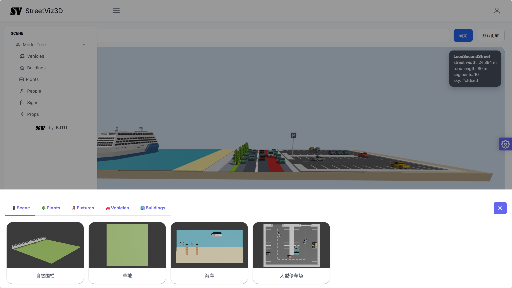

# StreetViz3D

<!-- Badges -->

<p align="center">
  
</p>


**StreetViz3D** 是一个全栈 Web 应用，将二维街道横断面设计转换为可交互的三维场景。支持从 Streetmix 链接导入方案，并自动生成包含车辆、植物、建筑等模型的沉浸式街景预览。

---

## 📋 目录

- [StreetViz3D](#streetviz3d)
  - [📋 目录](#-目录)
  - [✨ 特性](#-特性)
  - [📸 截图](#-截图)
  - [🚀 快速开始](#-快速开始)
    - [环境要求](#环境要求)
    - [配置与启动](#配置与启动)
      - [1. 数据库准备](#1-数据库准备)
      - [2. 启动 Nginx](#2-启动-nginx)
      - [3. 启动后端](#3-启动后端)
      - [4. 启动前端](#4-启动前端)
  - [🧱 技术架构](#-技术架构)
      - [📁 项目结构](#-项目结构)
  - [⚙️ 核心模块](#️-核心模块)
      - [前端](#前端)
      - [后端](#后端)
      - [核心 DTO](#核心-dto)
  - [📡 API 文档](#-api-文档)
      - [用户与认证](#用户与认证)
      - [街道与场景](#街道与场景)
      - [模型资产](#模型资产)
  - [🎨 模型资产](#-模型资产)

---

## ✨ 特性

- **Streetmix 集成**：输入 Streetmix URL，后端自动解析并生成 3D 场景
- **程序化场景生成**：根据道路分段、宽度、边界自动生成路面、车辆、树木、建筑
- **交互式 3D 渲染**：基于 A-Frame / Three.js，支持自由视角漫游
- **模型资产库**：分类管理车辆、植物、设施、建筑等 GLTF 模型
- **用户系统**：注册/登录、头像上传、个人街道库管理

---

## 📸 截图



---

## 🚀 快速开始

### 环境要求

- **后端**：JDK 21+、PostgreSQL 15+、Maven（或使用 wrapper）
- **前端**：Node.js 18+、npm 或 yarn
- **静态资源服务器**：Nginx（用于托管模型与用户头像）

### 配置与启动

#### 1. 数据库准备

创建 PostgreSQL 数据库 `streetviz3d`，在 `backend/src/main/resources/application.properties` 中配置连接信息，并设置环境变量 `DB_PASSWORD`。

#### 2. 启动 Nginx

配置 Nginx 提供静态文件：

- 模型基础地址：`app.nginx.base-url`（默认 `http://localhost:65`）
- 上传目录：`app.nginx.upload-dir`（存放用户头像）

#### 3. 启动后端

```bash
cd backend
./mvnw spring-boot:run   # Linux/macOS
mvnw.cmd spring-boot:run # Windows
```

#### 4. 启动前端

```bash
cd frontend
npm install
npm run dev
```

访问 http://localhost:3000 即可使用。

## 🧱 技术架构

前后端分离架构，由四部分组成：

| 组件 | 技术 |
|---|---|
| 前端 | Next.js 13 (App Router) + PrimeReact + A-Frame + TypeScript |
| 后端 | Spring Boot + MyBatis-Plus + Maven + Java 21 |
| 数据库 | PostgreSQL 15+ |
| 静态资源 | Nginx (GLTF 模型、头像) |

请求流程：前端调用 Spring Boot API → 后端返回 `Result<T>` 统一格式 → 前端通过 Nginx 加载模型/头像资源。后端已配置 CORS，允许 `http://localhost:3000` 进行本地联调。

#### 📁 项目结构

```text
StreetViz3D/
├── frontend/                 # Next.js 前端
│   ├── app/                  # 页面与路由
│   ├── layout/               # 顶栏、侧边栏、3D容器、模型面板
│   └── styles/               # 样式文件
├── backend/                  # Spring Boot 后端
│   ├── src/main/java/.../controller
│   ├── .../service
│   ├── .../mapper
│   ├── .../dto / entity
│   └── src/main/resources/application.properties
└── asset/             # 资源目录
```

## ⚙️ 核心模块

#### 前端

- `ModelContainer`：核心 3D 渲染组件，读取 `StreetSceneDTO` 并生成 A-Frame 场景，处理模型加载、相机控制、光照和实时刷新。

- `fly-controls-y`：自定义控件，支持垂直方向视角升降。

- API 客户端：`auth.ts`（用户认证）、`street.ts`（街道数据与 Streetmix 集成）。

#### 后端

- Street Data Pipeline：围绕 `Street`、`Segment`、`Boundary` 三个实体，完成数据存取与转换。

- Streetmix 集成：`StreetmixController` → `StreetmixService` → 解析 Streetmix API → 生成场景。

- 3D Scene Layout Engine（`StreetSceneLayoutService`）：将二维断面宽度映射到三维坐标，计算每个 segment 的 `startX/centerX/endX`，随机选择车辆、树木、边界模型，生成完整 `StreetSceneDTO`。关键常量：
  
  - `DEFAULT_ROAD_LENGTH = 80.0`
  
  - `DEFAULT_WIDTH_SCALE = 1.5`

#### 核心 DTO

- StreetSceneDTO：包含 segments、leftBoundary、rightBoundary、roadLength 等。

- SegmentSceneDTO：道路分段（车道、人行道等），含表面与实例对象。

- BoundarySceneDTO：左右边界环境，含建筑、草地等实例。

- SceneInstanceDTO：最小渲染单元（车辆、树木等），含 modelUrl、position、rotation、scale、color。

## 📡 API 文档

#### 用户与认证

| 方法     | 路径                 | 说明          |
| ------ | ------------------ | ----------- |
| POST   | `/user/register`   | 注册          |
| POST   | `/user/login`      | 登录          |
| DELETE | `/user/logout`     | 登出（占位）      |
| GET    | `/user/id`         | 根据邮箱获取用户 ID |
| GET    | `/user/info`       | 获取用户信息      |
| POST   | `/user/avatar`     | 上传头像        |
| PUT    | `/user/password`   | 修改密码        |
| GET    | `/user/streetList` | 获取用户街道列表    |

#### 街道与场景

| 方法   | 路径                          | 说明                   |
| ---- | --------------------------- | -------------------- |
| GET  | `/api/streets/{id}/preview` | 获取 2D 预览配置           |
| GET  | `/api/streets/{id}/scene`   | 获取完整 3D 场景           |
| POST | `/api/streetmix/scene`      | 从 Streetmix URL 生成场景 |

#### 模型资产

| 方法  | 路径                                                 | 说明         |
| --- | -------------------------------------------------- | ---------- |
| GET | `/model/type?type=Vehicle\|Plant\|Scene\|Building` | 获取某类模型预览列表 |

## 🎨 模型资产

所有 3D 模型位于 assets/models/，按类别存放：

Urban：建筑、车辆、道路设施

Nature：树木、花卉、自然边界

每个模型通常包含：

Preview_[ModelName].png（预览图）

[ModelName].blend（源文件）

gltf_model/[ModelName].gltf + .bin + 贴图

运行时系统通过 resolveModelUrl() 将相对路径转为绝对 URL，从 Nginx 加载。.blend 等备份文件不参与前端加载。
